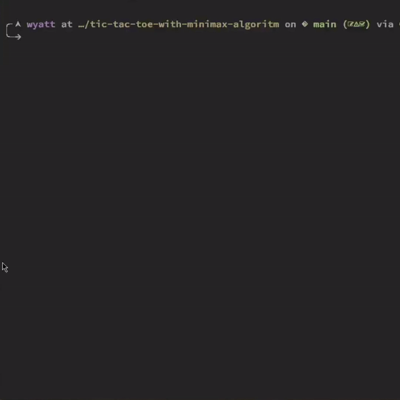

# tic-tac-toe w/ minimax

## Credit

- completed as part of CSE-30 at UC Santa Cruz for professor Larissa Munishkina
- the while loop in `tictac.py` was provided, but everything else was my own implimentation

## Usage

- run `python tictac.py` to play
- adjust the classes on lines 16 & 17 in order to change the functionality of the game

## Classes

- `class Player` allows for user inputted moves
- `class AI` utilizes random selection in order to make moves
- `class MiniMax` utilizes the minimax algoritm to make its moves
- `class SmartAI` utilizes a random choice for the first move and then uses minimax, as calling minimax for an empty board isn't necessary

## Preview

